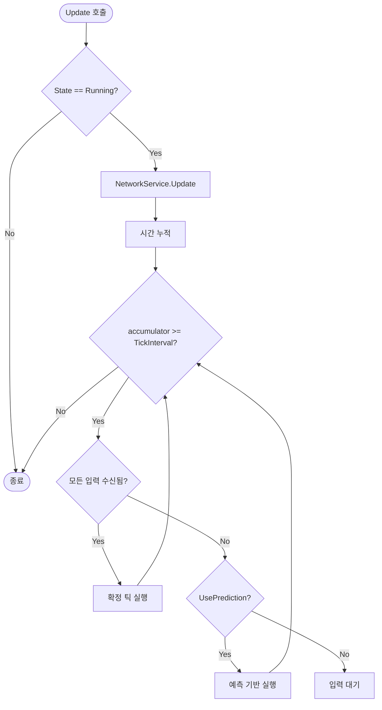
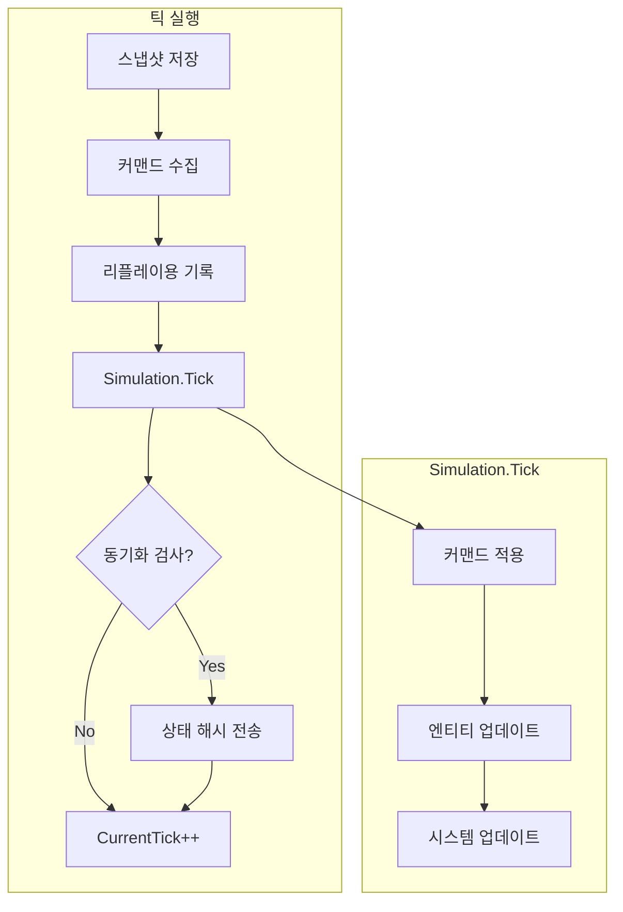
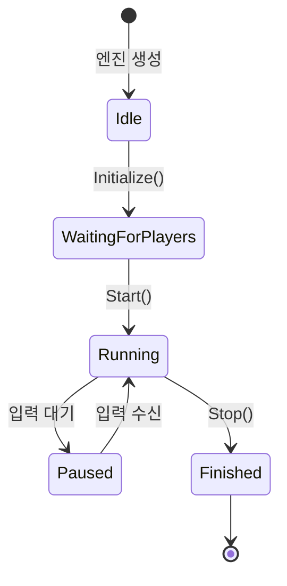

# xpTURN.Lockstep

Unity 멀티플레이어 게임을 위한 결정론적 락스텝 네트워킹 프레임워크입니다.

## 개요

xpTURN.Lockstep은 결정론적 시뮬레이션이 필요한 실시간 멀티플레이어 게임을 위해 설계된 락스텝 동기화 시스템입니다. 게임 상태가 아닌 플레이어 입력을 동기화하여 모든 클라이언트가 동일한 게임 로직을 동일한 결과로 실행하도록 보장합니다.

### 주요 기능

- **결정론적 시뮬레이션**: 고정소수점 연산으로 모든 클라이언트에서 동일한 결과 보장
- **입력 지연 보상**: 네트워크 지연을 숨기기 위한 설정 가능한 입력 지연
- **예측 & 롤백**: 입력이 지연되어도 부드러운 게임플레이 유지
- **동기화 오류 감지**: 주기적인 상태 해시 검증으로 동기화 문제 감지
- **리플레이 시스템**: 게임 세션 녹화 및 재생
- **GC-Free 설계**: 게임플레이 중 가비지 컬렉션을 최소화하는 오브젝트 풀링

## 아키텍처

```
Lockstep/
├── Core/                    # 핵심 락스텝 엔진
│   ├── ILockstepEngine.cs   # 메인 엔진 인터페이스
│   ├── ISimulation.cs       # 결정론적 시뮬레이션 인터페이스
│   ├── ICommand.cs          # 커맨드 (입력) 인터페이스
│   └── Impl/                # 구현체
├── Input/                   # 입력 처리
│   ├── IInputBuffer.cs      # 입력 버퍼링 인터페이스
│   ├── IInputHandler.cs     # 입력 캡처 인터페이스
│   └── Impl/                # 구현체
├── Network/                 # 네트워크 동기화
│   ├── ILockstepNetworkService.cs
│   ├── INetworkTransport.cs
│   └── Impl/                # 구현체
├── State/                   # 게임 상태 관리
│   ├── IWorldState.cs       # 월드 상태 인터페이스
│   ├── IStateSnapshot.cs    # 롤백용 스냅샷
│   ├── IStateSyncable.cs    # 동기화 가능한 엔티티 인터페이스
│   └── Impl/                # 구현체
├── Math/                    # 결정론적 수학
│   ├── IFixedPoint.cs       # 고정소수점 숫자 인터페이스
│   ├── IFixedVector.cs      # 고정소수점 벡터 인터페이스
│   └── Impl/                # FP64, FPVector2, FPVector3
├── Replay/                  # 리플레이 시스템
│   ├── IReplaySystem.cs     # 리플레이 인터페이스
│   └── Impl/                # ReplayRecorder, ReplayPlayer
├── Sample/                  # 샘플 구현
└── Tests/                   # 유닛 테스트
```

## 시스템 흐름

### 메인 게임 루프



### 틱 실행 흐름



## 빠른 시작

### 1. 설정

```csharp
// 설정으로 락스텝 엔진 생성
var config = new LockstepConfig
{
    TickIntervalMs = 50,      // 초당 20틱
    InputDelayTicks = 2,       // 2틱 입력 지연
    MaxRollbackTicks = 10,     // 최대 롤백 프레임
    SyncCheckInterval = 30,    // 30틱마다 동기화 검사
    UsePrediction = true       // 입력 예측 활성화
};

var engine = new LockstepEngine(config);
```

### 2. 초기화

```csharp
// 시뮬레이션과 네트워크 서비스 생성
ISimulation simulation = new MyGameSimulation();
ILockstepNetworkService networkService = new LockstepNetworkService();

// 네트워크 초기화
networkService.Initialize(transport, commandFactory);

// 엔진 초기화
engine.Initialize(simulation, networkService);
```

### 3. 게임 루프

```csharp
void Update()
{
    // 매 프레임 락스텝 엔진 업데이트
    engine.Update(Time.deltaTime);
}
```

### 4. 입력 처리

```csharp
// 플레이어 입력 전송
void OnPlayerInput(Vector2 movement, bool attack)
{
    var command = new MoveCommand
    {
        Movement = movement.ToFPVector2(),
        Attack = attack
    };
    
    engine.InputCommand(command);
}
```

### 5. 시뮬레이션 구현

```csharp
public class MyGameSimulation : ISimulation
{
    public int CurrentTick { get; private set; }
    
    public void Initialize()
    {
        // 초기 게임 상태 설정
    }
    
    public void Tick(IEnumerable<ICommand> commands)
    {
        // 커맨드 적용
        foreach (var cmd in commands)
        {
            ApplyCommand(cmd);
        }
        
        // 결정론적으로 게임 로직 업데이트
        UpdateEntities();
        UpdatePhysics();
        
        CurrentTick++;
    }
    
    public void Rollback(int targetTick)
    {
        // 스냅샷에서 상태 복원
    }
    
    public long GetStateHash()
    {
        // 현재 게임 상태의 해시 반환
    }
}
```

### 6. 커맨드 구현

```csharp
public class MoveCommand : CommandBase
{
    public FPVector2 Movement { get; set; }
    public bool Attack { get; set; }
    
    public override int CommandType => 1;
    
    public override byte[] Serialize()
    {
        // 바이트로 직렬화
    }
    
    public override void Deserialize(byte[] data)
    {
        // 바이트에서 역직렬화
    }
}
```

## 결정론적 수학

결정론적 계산을 위해 고정소수점 수학을 사용합니다:

```csharp
// 고정소수점 숫자 (64비트, 32비트 소수부)
FP64 a = FP64.FromInt(10);
FP64 b = FP64.FromFloat(2.5f);
FP64 c = a * b;  // 결정론적 곱셈

// 고정소수점 벡터
FPVector2 pos = new FPVector2(FP64.One, FP64.Zero);
FPVector2 vel = new FPVector2(FP64.FromFloat(0.5f), FP64.FromFloat(0.5f));
FPVector2 newPos = pos + vel;

// 결정론적 난수
var random = new DeterministicRandom(seed);
int value = random.Next(0, 100);  // 같은 시드 = 같은 시퀀스
```

## 리플레이 시스템

### 녹화

```csharp
// engine.Start()와 함께 자동으로 녹화 시작
engine.Start(enableRecording: true);

// ... 게임플레이 ...

// 중지 및 리플레이 저장
engine.Stop();
engine.SaveReplayToFile("replay.rply");
```

### 재생

```csharp
// 리플레이 로드 및 재생
engine.StartReplayFromFile("replay.rply");

// 재생 제어
engine.SetReplaySpeed(ReplaySpeed.Double);
engine.PauseReplay();
engine.ResumeReplay();
engine.SeekReplay(targetTick);
```

## 설정

| 파라미터 | 기본값 | 설명 |
|----------|--------|------|
| `TickIntervalMs` | 50 | 틱당 밀리초 (초당 20틱) |
| `InputDelayTicks` | 2 | 지연 숨김을 위한 입력 지연 |
| `MaxRollbackTicks` | 10 | 롤백 가능한 최대 프레임 |
| `SyncCheckInterval` | 30 | 동기화 검사 간격 (틱) |
| `UsePrediction` | true | 입력 예측 활성화 |

## 이벤트

```csharp
// 틱 실행됨
engine.OnTickExecuted += (tick) => {
    Debug.Log($"틱 {tick} 실행됨");
};

// 동기화 오류 감지됨
engine.OnDesyncDetected += (localHash, remoteHash) => {
    Debug.LogError($"동기화 오류! 로컬: {localHash}, 원격: {remoteHash}");
};

// 네트워크 이벤트
networkService.OnPlayerJoined += (player) => { };
networkService.OnPlayerLeft += (player) => { };
networkService.OnGameStart += () => { };
```

## 상태 다이어그램



## 모범 사례

1. **결정론**: 게임 로직 계산에는 항상 고정소수점 수학 사용
2. **커맨드 설계**: 커맨드는 작고 직렬화 가능하게 유지
3. **상태 스냅샷**: 효율적인 롤백을 위해 정기적으로 스냅샷 저장
4. **네트워크 전송**: 커맨드에 대해 신뢰성 있는 순서 보장 전달 구현
5. **테스팅**: 리플레이 시스템을 사용하여 문제 재현 및 디버깅

## 참고

1. xpTURN.Lockstep은 락스텝 로직의 동작 규칙을 쉽게 파악 할 수 있게 최소한의 코드로 구성되어 있습니다. 개별 게임 특화 코드 확장이 필요합니다.
2. 결정론적 수학 라이브러리 사용 시 오버플로우 발생에 주의하여야 합니다. 예를 들어 매우 큰 백터의 SqrMagnitude, Dot 연산 등에서 쉽게 발생 할 수 있습니다. 감안 필요합니다.

## 요구사항

- Unity 2021.1 이상
- .NET Standard 2.1

## 라이선스

MIT 라이선스
