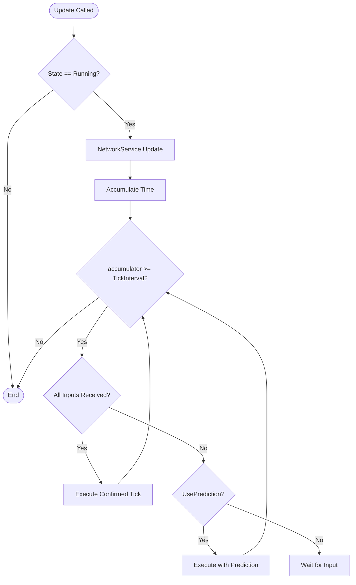
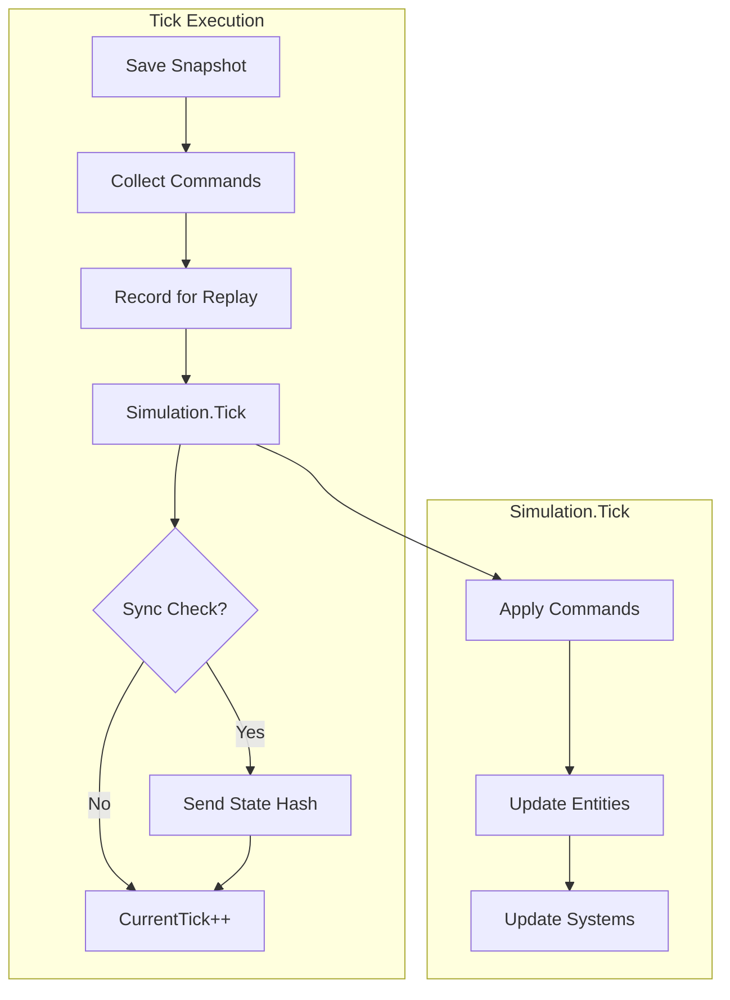
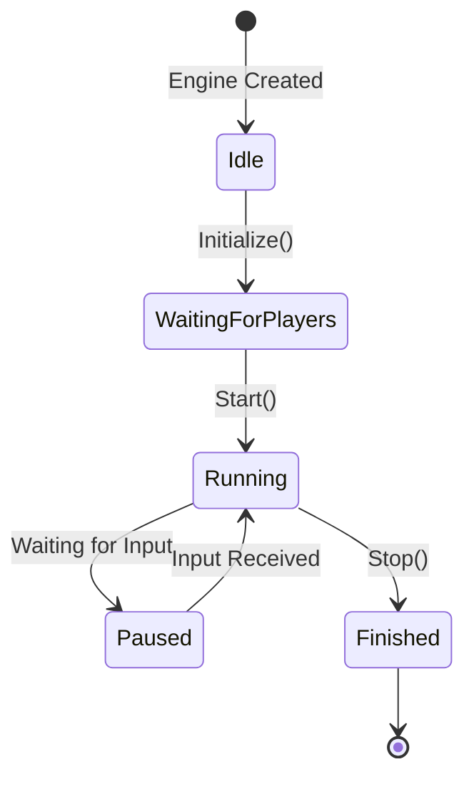

# xpTURN.Lockstep

A deterministic lockstep networking framework for Unity multiplayer games.

## Overview

xpTURN.Lockstep is a lockstep synchronization system designed for real-time multiplayer games that require deterministic simulation. It ensures all clients execute the same game logic with identical results by synchronizing player inputs rather than game state.

### Key Features

- **Deterministic Simulation**: Fixed-point math ensures identical results across all clients
- **Input Delay Compensation**: Configurable input delay to hide network latency
- **Prediction & Rollback**: Continues gameplay smoothly even when inputs are delayed
- **Desync Detection**: Periodic state hash verification to detect synchronization issues
- **Replay System**: Record and playback game sessions
- **GC-Free Design**: Object pooling to minimize garbage collection during gameplay

## Architecture

```
Lockstep/
├── Core/                    # Core lockstep engine
│   ├── ILockstepEngine.cs   # Main engine interface
│   ├── ISimulation.cs       # Deterministic simulation interface
│   ├── ICommand.cs          # Command (input) interface
│   └── Impl/                # Implementations
├── Input/                   # Input handling
│   ├── IInputBuffer.cs      # Input buffering interface
│   ├── IInputHandler.cs     # Input capture interface
│   └── Impl/                # Implementations
├── Network/                 # Network synchronization
│   ├── ILockstepNetworkService.cs
│   ├── INetworkTransport.cs
│   └── Impl/                # Implementations
├── State/                   # Game state management
│   ├── IWorldState.cs       # World state interface
│   ├── IStateSnapshot.cs    # Snapshot for rollback
│   ├── IStateSyncable.cs    # Syncable entity interface
│   └── Impl/                # Implementations
├── Math/                    # Deterministic math
│   ├── IFixedPoint.cs       # Fixed-point number interface
│   ├── IFixedVector.cs      # Fixed-point vector interface
│   └── Impl/                # FP64, FPVector2, FPVector3
├── Replay/                  # Replay system
│   ├── IReplaySystem.cs     # Replay interface
│   └── Impl/                # ReplayRecorder, ReplayPlayer
├── Sample/                  # Sample implementation
└── Tests/                   # Unit tests
```

## System Flow

### Main Game Loop



### Tick Execution Flow



## Quick Start

### 1. Setup

```csharp
// Create lockstep engine with configuration
var config = new LockstepConfig
{
    TickIntervalMs = 50,      // 20 ticks per second
    InputDelayTicks = 2,       // 2 tick input delay
    MaxRollbackTicks = 10,     // Maximum rollback frames
    SyncCheckInterval = 30,    // Sync check every 30 ticks
    UsePrediction = true       // Enable input prediction
};

var engine = new LockstepEngine(config);
```

### 2. Initialize

```csharp
// Create simulation and network service
ISimulation simulation = new MyGameSimulation();
ILockstepNetworkService networkService = new LockstepNetworkService();

// Initialize network
networkService.Initialize(transport, commandFactory);

// Initialize engine
engine.Initialize(simulation, networkService);
```

### 3. Game Loop

```csharp
void Update()
{
    // Update lockstep engine every frame
    engine.Update(Time.deltaTime);
}
```

### 4. Input Handling

```csharp
// Send player input
void OnPlayerInput(Vector2 movement, bool attack)
{
    var command = new MoveCommand
    {
        Movement = movement.ToFPVector2(),
        Attack = attack
    };
    
    engine.InputCommand(command);
}
```

### 5. Implement Simulation

```csharp
public class MyGameSimulation : ISimulation
{
    public int CurrentTick { get; private set; }
    
    public void Initialize()
    {
        // Setup initial game state
    }
    
    public void Tick(IEnumerable<ICommand> commands)
    {
        // Apply commands
        foreach (var cmd in commands)
        {
            ApplyCommand(cmd);
        }
        
        // Update game logic deterministically
        UpdateEntities();
        UpdatePhysics();
        
        CurrentTick++;
    }
    
    public void Rollback(int targetTick)
    {
        // Restore state from snapshot
    }
    
    public long GetStateHash()
    {
        // Return hash of current game state
    }
}
```

### 6. Implement Commands

```csharp
public class MoveCommand : CommandBase
{
    public FPVector2 Movement { get; set; }
    public bool Attack { get; set; }
    
    public override int CommandType => 1;
    
    public override byte[] Serialize()
    {
        // Serialize to bytes
    }
    
    public override void Deserialize(byte[] data)
    {
        // Deserialize from bytes
    }
}
```

## Deterministic Math

Use fixed-point math for deterministic calculations:

```csharp
// Fixed-point number (64-bit with 32-bit fraction)
FP64 a = FP64.FromInt(10);
FP64 b = FP64.FromFloat(2.5f);
FP64 c = a * b;  // Deterministic multiplication

// Fixed-point vectors
FPVector2 pos = new FPVector2(FP64.One, FP64.Zero);
FPVector2 vel = new FPVector2(FP64.FromFloat(0.5f), FP64.FromFloat(0.5f));
FPVector2 newPos = pos + vel;

// Deterministic random
var random = new DeterministicRandom(seed);
int value = random.Next(0, 100);  // Same seed = same sequence
```

## Replay System

### Recording

```csharp
// Recording starts automatically with engine.Start()
engine.Start(enableRecording: true);

// ... gameplay ...

// Stop and save replay
engine.Stop();
engine.SaveReplayToFile("replay.rply");
```

### Playback

```csharp
// Load and play replay
engine.StartReplayFromFile("replay.rply");

// Control playback
engine.SetReplaySpeed(ReplaySpeed.Double);
engine.PauseReplay();
engine.ResumeReplay();
engine.SeekReplay(targetTick);
```

## Configuration

| Parameter | Default | Description |
|-----------|---------|-------------|
| `TickIntervalMs` | 50 | Milliseconds per tick (20 ticks/sec) |
| `InputDelayTicks` | 2 | Input delay for latency hiding |
| `MaxRollbackTicks` | 10 | Maximum frames to rollback |
| `SyncCheckInterval` | 30 | Ticks between sync checks |
| `UsePrediction` | true | Enable input prediction |

## Events

```csharp
// Tick executed
engine.OnTickExecuted += (tick) => {
    Debug.Log($"Tick {tick} executed");
};

// Desync detected
engine.OnDesyncDetected += (localHash, remoteHash) => {
    Debug.LogError($"Desync! Local: {localHash}, Remote: {remoteHash}");
};

// Network events
networkService.OnPlayerJoined += (player) => { };
networkService.OnPlayerLeft += (player) => { };
networkService.OnGameStart += () => { };
```

## State Diagram



## Notes

1. xpTURN.Lockstep is designed with minimal code to make it easy to understand the operational rules of lockstep logic. Extension with game-specific code is required.
2. Be cautious of overflow when using the deterministic math library. For example, overflow can easily occur in operations like SqrMagnitude or Dot on very large vectors. Please keep this in mind.

## Requirements

- Unity 2021.1 or later
- .NET Standard 2.1

## License

MIT License
